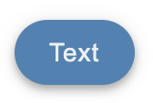
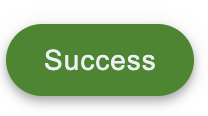
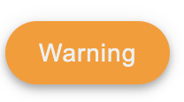
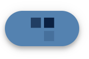
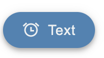
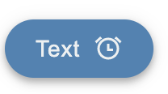
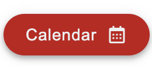

# Button Component

## Usage

The component can be used without props the same way you would use the standard button component from React.

```js
return (
  <>
    <Button> Text </Button>
  </>
);
```

Renders:



> **Note:**
> The default color of the button is the secondary color (Light Blue)

## Usage as Link

In order to use the button as a link, use the `href` prop and input the name of the page you plan on linking to.

```js
return (
  <>
    <Button href="/destination">Link</Button>
  </>
);
```

This will appear the same as the button seen above, but will link to the page specified in `href=''`

> **Note:**
> If using the button as a Link, adding an `onClick` prop will not work.

Also, since a `<Link>` is being returned when using the Button for this purpose, make sure it is inside of a `<Router>` component, otherwise it will throw an error.

---

## Customization

In addition to these props the button still accepts standard HTML props like disabled.

### `color?: primary | secondary | warning | success | danger`

Optional. Default value: `Secondary`;

```js
return (
  <>
    <Button color="success">Success</Button>
  </>
);
```

Renders:



```js
return (
  <>
    <Button color="warning">Warning</Button>
  </>
);
```

Renders:



### `loading?: boolean`

Optional. Displays a square loading spinner when the action from clicking the button takes time to complete.

> Additionally, the `loadingDelay` prop can be used to specify the amount of time (in milliseconds) the button should wait before displaying the loading spinner. The default value of this prop is `500` (milliseconds).

```js
return (
  <>
    <Button loading={true} loadingDelay={1000}>
      Delay
    </Button>
  </>
);
```

Renders:



> **Note:**
> The above spinner would be displayed after 1 second due to the `loadingDelay` prop.

### Icons

There are two ways to use icons with this button - with text or alone.
Both methods require icons that are imported independent to the button and passed in.

#### With text

Icons can be added to the beginning or end of a button with text alongside them.

```js
import {BiTime} from 'react-icons/bi';

return (
  <>
    <Button leadingIcon={BiTime}>Text</Button>;
  </>
);
```

Renders:



```js
import {CgAlarm} from 'react-icons/cg';

return (
  <>
    <Button trailingIcon={CgAlarm}>Text</Button>;
  </>
);
```

Renders:



#### Without Text

Buttons can be icon-only with the `centeredIcon` prop. Any text entered will be ignored.

```js
import {GoArrowDown} from 'react-icons/go';

return (
  <>
    <Button centeredIcon={GoArrowDown}></Button>;
  </>
);
```

Renders:


> **Note:** > `leadingIcon` and `trailingIcon` can be used in combination with one another. However, `centeredIcon` cannot be used with either of these props.

---

## Mixing

The customizations listed above can be used in combination with one another

```js
import {BiCalendar} from 'react-icons/bi';

return (
  <>
    <Button color="danger" trailingIcon={BiCalendar} href="/calendar">
      Calendar
    </Button>
    ;
  </>
);
```

Renders:



With the `href` prop, the button above would link to the specified /calendar page
